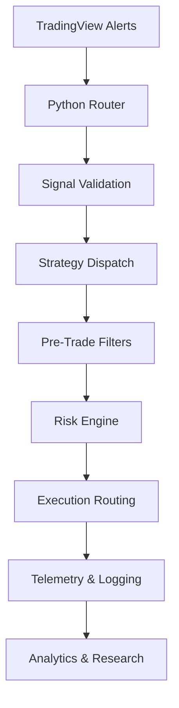

# Architecture Overview

## Signal Flow

## Design Goals

- Decouple strategy logic from execution infrastructure.
- Keep risk controls independent from signal generation.
- Make operational failures visible through telemetry.
- Separate live and simulation analytics.
- Preserve reproducible event histories for research.

## Operational Telemetry

The infrastructure logs:

- signal validation failures
- filter rejections
- safemode/circuit-breaker activations
- execution outcomes
- EV statistics
- routing decisions
- latency and operational events

The goal is observability rather than opacity.
