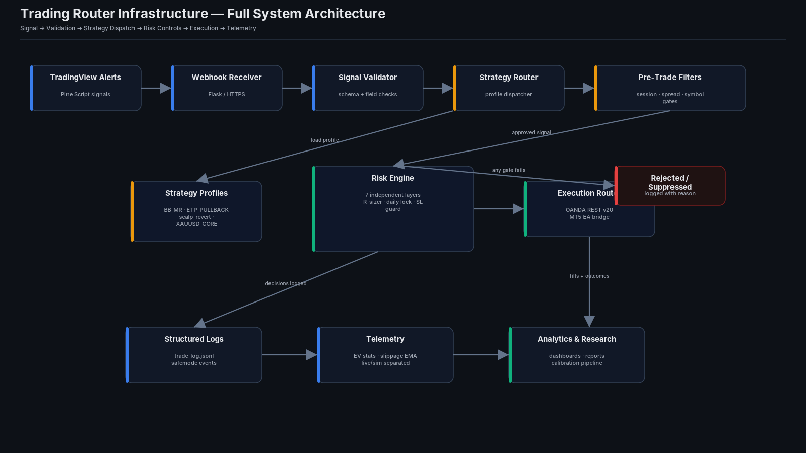
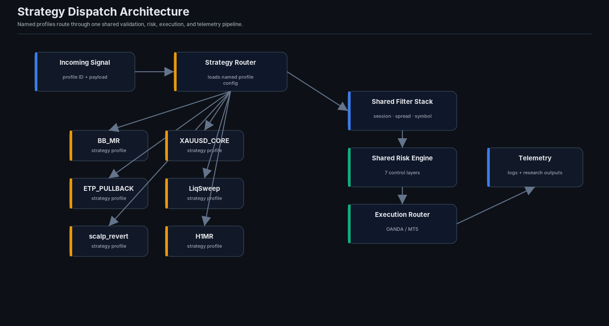
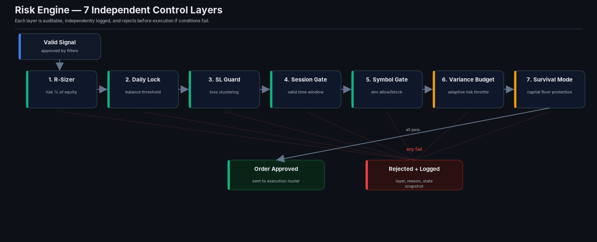
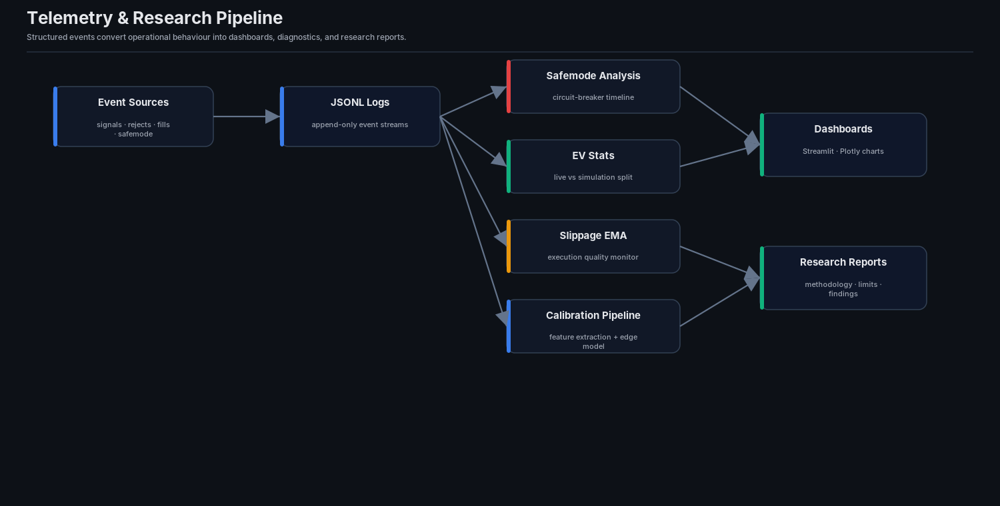
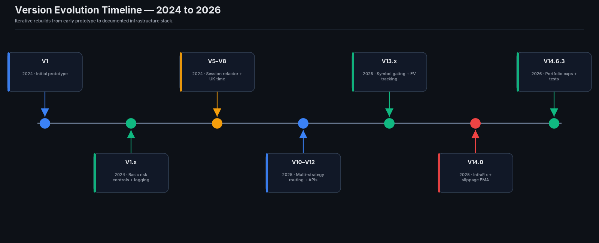

# Trading Router Infrastructure

Public documentation for a multi-year systematic trading infrastructure project covering signal routing, validation, risk controls, execution workflows, telemetry, and research methodology.

> This repository is a public portfolio/documentation layer. It does not contain private strategy logic, raw trade logs, account data, broker credentials, or proprietary parameters.

---

## Full System Architecture

---

## Strategy Dispatch Architecture

---

## Risk Engine

---

## Telemetry & Research Pipeline

---

## Version Evolution Timeline

---

## Project Context

This project began in 2024 as a small research and automation workflow and has evolved through repeated rebuilds into a larger Python-based trading infrastructure stack.

The public purpose of this repository is to evidence:

- systems architecture
- risk-aware design
- operational telemetry
- live vs simulation data separation
- research methodology
- documentation quality

It is not a profitability record and does not make trading-performance claims.

---

## Core Architecture

| Layer | Purpose |
|---|---|
| Signal layer | Receives structured alerts from TradingView/Pine workflows |
| Validation layer | Checks signal shape, required fields, and routing eligibility |
| Dispatch layer | Routes named strategy profiles through shared infrastructure |
| Filter layer | Applies session, spread, symbol, and operational gates |
| Risk layer | Applies independent position/risk controls before execution |
| Execution layer | Routes approved orders through broker/execution interfaces |
| Telemetry layer | Logs events for monitoring, analytics, and research review |

---

## What Is Deliberately Not Included

- Broker API keys or credentials
- OANDA/MT5 configuration files
- Raw trade logs or account records
- Exact strategy entry/exit logic
- Private strategy parameters
- Pine Script alpha logic
- P&L screenshots or account-balance claims

---

## Research Principles

- Separate live, paper, and simulation data.
- Label sample-size limitations clearly.
- Treat backtests as hypotheses, not proof.
- Prefer telemetry and reproducible logs over subjective claims.
- Show methodology and limitations before conclusions.

---

## Disclaimer

This repository is for educational and portfolio demonstration purposes only. Nothing here is financial advice, a recommendation to trade, or evidence of real investment performance.
